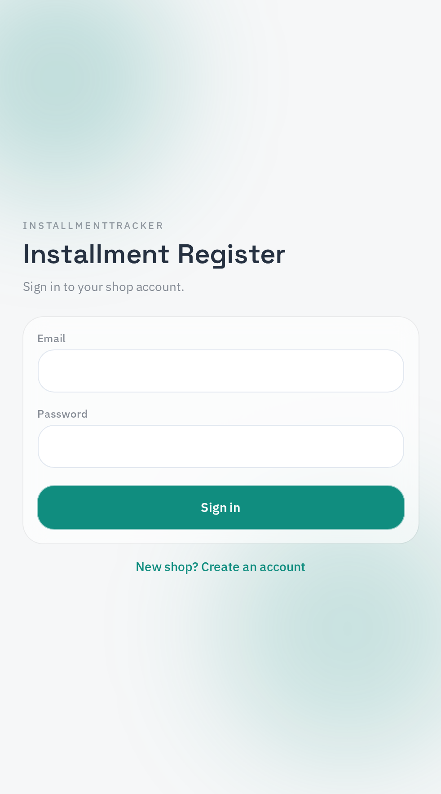
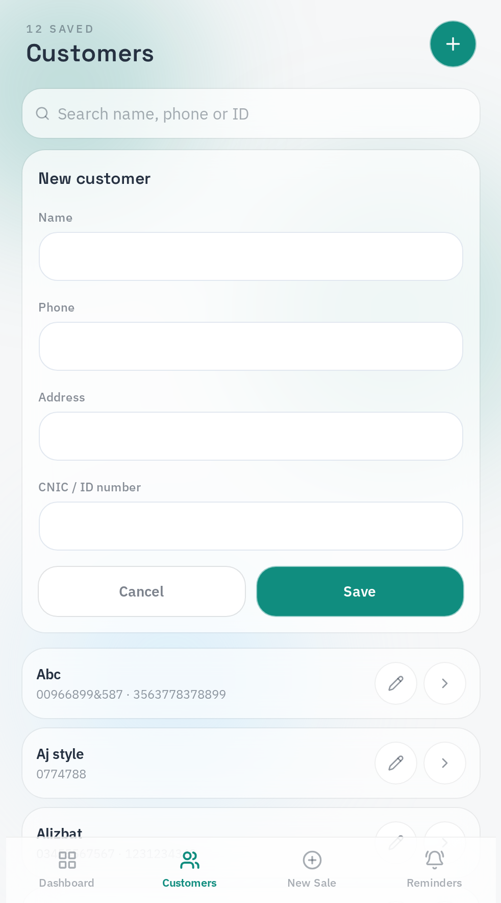
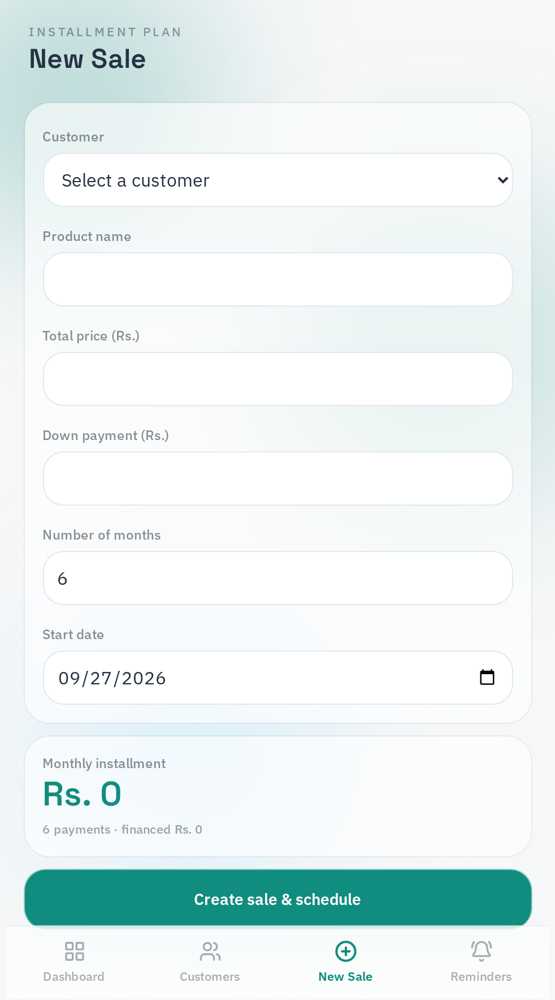
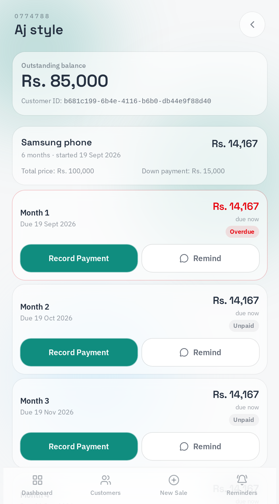

# Installment Hub

Installment Hub is a mobile-friendly web app for small shops that sell products on monthly installments. Shop owners manage their customers, automatically generate a fair monthly payment schedule when a sale is made, record payments as they come in, and send WhatsApp reminders when an installment is due — all from one simple dashboard.

## Screenshots

**Login**

**Dashboard**

**Add Customer**

**New Sale**

**Installment Schedule**

**Payment Reminders**

## Features

- **Customer management** — add, edit, and search customers by name, phone, address, or CNIC/ID number.
- **Automatic installment schedule generation** — enter a total price, down payment, and number of months; the app calculates the monthly amount and builds the full schedule (the last month absorbs any rounding difference so totals always match).
- **Payment recording with automatic balance and overpayment handling** — payments are applied to the selected installment first; any extra amount rolls forward into the next unpaid installments automatically.
- **Overpaid/credit balance tracking** — if a customer pays more than they owe in total, the extra is tracked and shown as a clear credit balance, even after the final installment is settled.
- **WhatsApp payment reminders** — one tap opens WhatsApp with a pre-filled, polite payment reminder message for the due installment.
- **Secure login with brute-force protection** — accounts are temporarily locked after repeated failed sign-in attempts, and every attempt is logged so owners can review their sign-in activity.
- **Data isolation between shop owners** — every record is scoped to its owner with row-level security, so shops only ever see their own customers, sales, and payments.

## Security

This project was manually tested for common vulnerabilities, including insecure direct object reference (IDOR) and cross-account data access. Issues found during testing were identified and fixed.

## Tech Stack

- React 19 + TypeScript
- TanStack Start (SSR, file-based routing, server functions)
- Tailwind CSS v4
- Supabase (PostgreSQL database, authentication, row-level security)

## Live App

https://qists-manager.lovable.app

Built with Lovable.
